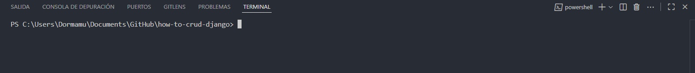
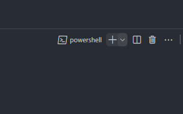
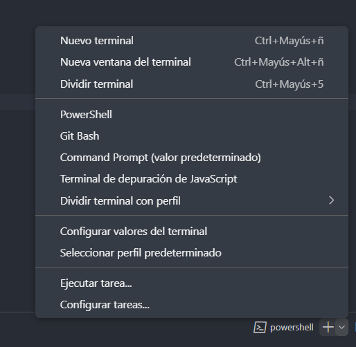
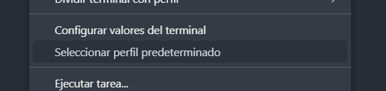
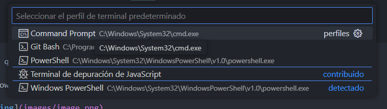
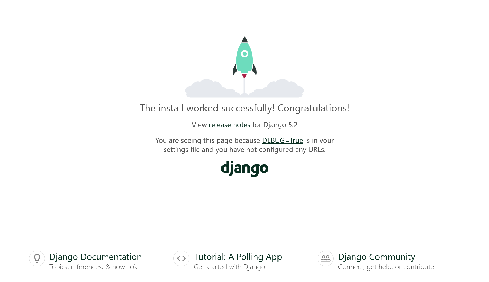
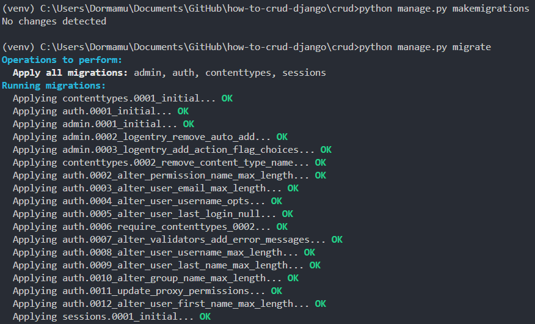
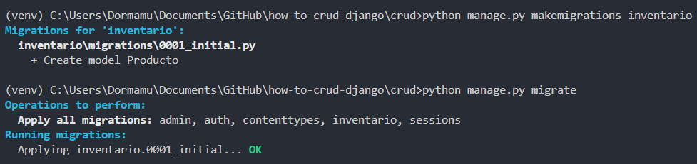
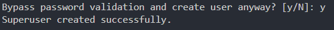

# How to CRUD con DJANGO
Este proyecto es una guía paso a paso para crear una aplicación CRUD (Crear, Leer, Actualizar, Eliminar) utilizando el framework Django en Python. A continuación, se detallan los pasos necesarios para configurar el entorno de desarrollo y comenzar a trabajar con Django.

## Paso 1: Establece la CMD cómo terminal predeterminada
Primero comprueba que estás utilizando la CMD de Windows (no PowerShell).

Si estás con la PowerShell, se ve de la siguiente forma:

1. Revisa la terminal gracias a su aspecto:
<br/>


2. Presiona la flecha que está al lado del nombre de la terminal.
<br/>


3. Haz clic para desplegar las opciones.
<br/>


4. Haz clic en "Seleccionar perfil predeterminado".
<br/>


5. Selecciona "Command Prompt".
<br/>


## Paso 2: Crea un entorno virtual e instala Django
Abre la terminal CMD y ejecuta los siguientes comandos:
Crea un entorno virtual llamado `venv`:
```bash
python -m venv venv
```
Activa el entorno virtual:
```bash
venv\Scripts\activate.bat
```
Instala Django:
```bash
pip install django
```
Crea el proyecto Django llamado `crud`:
```bash
django-admin startproject crud
```
Ingresa a la carpeta del proyecto:
```bash
cd crud
```
Ejecuta el servidor de desarrollo:
```bash
python manage.py runserver
```

Visita `http://127.0.0.1:8000/` en tu navegador. Deberías ver la página de bienvenida de Django, lo que indica que el servidor está funcionando correctamente.



Para interrumpir el proceso de Django y reutilizar la terminal, utiliza esta combinacion de teclas dentro del terminal en Visual Studio Code:
> CTRL + C

## Paso 3: Crea una aplicación Django
Dentro de la carpeta del proyecto `crud`, crea una aplicación llamada `inventario`:
```bash
python manage.py startapp inventario
```

Adicionalmente, para habilitar las caracteristicas de Django debemos de aplicar el concepto de `migraciones`, para ello ejecuta el siguiente comando:

1. Primero, crea las migraciones:
```bash
python manage.py makemigrations
```

2. Despues, aplica las migraciones:
```bash
python manage.py migrate
```



## Paso 4: Configura la aplicación en settings.py
Abre el archivo `crud/settings.py` y agrega `'inventario'` a la lista de `INSTALLED_APPS`:
```python
INSTALLED_APPS = [
    ...
    'inventario',
]
```

## Paso 5: Define el modelo de datos
En el archivo `inventario/models.py`, define el modelo de datos para los productos:

```python
from django.db import models

class Producto(models.Model):
    nombre = models.CharField(max_length=100)
    descripcion = models.TextField()
    precio = models.DecimalField(max_digits=10, decimal_places=2)
    cantidad = models.IntegerField()

    def __str__(self):
        return self.nombre
```

Luego, crea y aplica las migraciones para el nuevo modelo:
```bash
python manage.py makemigrations inventario
python manage.py migrate
```



## Paso 6: Crea un superusuario
Crea un superusuario para acceder al panel de administración de Django:
```bash
python manage.py createsuperuser
```

Sigue las instrucciones en la terminal para establecer el nombre de usuario, correo electrónico y contraseña.


Si te pide que la contraseña es muy comun, puedes forzar su uso escribiendo "y".




## Paso 7: Registra el modelo en el admin
En el archivo `inventario/admin.py`, registra el modelo `Producto` para que sea accesible desde el panel de administración:
```python
from django.contrib import admin
from .models import Producto

admin.site.register(Producto)
```

## Paso 8: Crea formularios
Crea un archivo `inventario/forms.py` y define un formulario para el modelo `Producto`. Esto facilitará la creación y edición de productos en las vistas:
```python
from django import forms
from .models import Producto
class ProductoForm(forms.ModelForm):
    class Meta:
        model = Producto
        fields = ['nombre', 'descripcion', 'precio', 'cantidad']
```

## Paso 9: Configura las vistas y URLs
Crea vistas para manejar las operaciones CRUD en `inventario/views.py` y configura las URLs en `inventario/urls.py` y `crud/urls.py`.

Primero, crea el archivo `inventario/urls.py` y agrega las siguientes rutas:
```python
from django.urls import path
from . import views
urlpatterns = [
    path("", views.lista_productos, name="lista_productos"),
    path("producto/<int:id>/", views.detalle_producto, name="detalle_producto"),
    path("producto/nuevo/", views.nuevo_producto, name="nuevo_producto"),
    path("producto/editar/<int:id>/", views.editar_producto, name="editar_producto"),
    path("producto/eliminar/<int:id>/", views.eliminar_producto, name="eliminar_producto"),
]
```

Luego, en `crud/urls.py`, incluiremos las vistas solicitadas las URLs de la aplicación `inventario`:
```python
from django.urls import include, path
from django.contrib import admin
urlpatterns = [
    path("admin/", admin.site.urls),
    path("", include("inventario.urls")),
]
```

Ahora, fabricaremos las vistas funcionales en `inventario/views.py`:
```python
from django.shortcuts import render, get_object_or_404, redirect
from .models import Producto
from .forms import ProductoForm

def lista_productos(request):
    productos = Producto.objects.all()
    return render(request, 'inventario/lista_productos.html', {'productos': productos})

def detalle_producto(request, id):
    producto = get_object_or_404(Producto, id=id)
    return render(request, 'inventario/detalle_producto.html', {'producto': producto})

def nuevo_producto(request):
    if request.method == 'POST':
        form = ProductoForm(request.POST)
        if form.is_valid():
            form.save()
            return redirect('lista_productos')
    else:
        form = ProductoForm()
    return render(request, 'inventario/nuevo_producto.html', {'form': form})

def editar_producto(request, id):
    producto = get_object_or_404(Producto, id=id)
    if request.method == 'POST':
        form = ProductoForm(request.POST, instance=producto)
        if form.is_valid():
            form.save()
            return redirect('lista_productos')
    else:
        form = ProductoForm(instance=producto)
    return render(request, 'inventario/editar_producto.html', {'form': form})

def eliminar_producto(request, id):
    producto = get_object_or_404(Producto, id=id)
    if request.method == 'POST':
        producto.delete()
        return redirect('lista_productos')
    return render(request, 'inventario/eliminar_producto.html', {'producto': producto})
```

Finalmente, podremos levantar las plantillas HTML para las vistas en la carpeta `inventario/templates/inventario/`.


## Paso 10: Crea las plantillas HTML
Crea las siguientes plantillas HTML en la carpeta `inventario/templates/inventario/`:

1. `base.html` - Plantilla base para heredar en otras plantillas.
2. `lista_productos.html` - Lista todos los productos.
3. `detalle_producto.html` - Muestra los detalles de un producto.
4. `nuevo_producto.html` - Formulario para crear un nuevo producto.
5. `editar_producto.html` - Formulario para editar un producto existente.
6. `eliminar_producto.html` - Confirmación para eliminar un producto.


### base.html
```html
<!DOCTYPE html>
<html lang="es">
  <head>
    <meta charset="UTF-8" />
    <meta name="viewport" content="width=device-width, initial-scale=1.0" />
    <title>
      
        Inventario
      
    </title>
    <script src="https://cdn.jsdelivr.net/npm/@tailwindcss/browser@4"></script>
  </head>

  <body class="bg-gray-100 text-gray-800">
    <nav class="bg-blue-600 p-4 text-white">
      <a href="" class="font-bold">Inventario</a>
    </nav>
    <div class="container mx-auto p-4">
      

      
    </div>
  </body>
</html>
```

### lista_productos.html
```html



  Lista de Productos



  <h1 class="text-2xl font-bold mb-4">Lista de Productos</h1>
  <a href="" class="bg-green-500 text-white px-4 py-2 rounded mb-4 inline-block hover:scale-105 transiiton-all ease-in">Nuevo Producto</a>
  <table class="min-w-full bg-white">
    <thead>
      <tr>
        <th class="py-2 px-4 border-b">Nombre</th>
        <th class="py-2 px-4 border-b">Descripción</th>
        <th class="py-2 px-4 border-b">Precio</th>
        <th class="py-2 px-4 border-b">Cantidad</th>
        <th class="py-2 px-4 border-b">Acciones</th>
      </tr>
    </thead>
    <tbody>
      
        <tr>
          <td class="py-2 px-4 border-b">{{ producto.nombre }}</td>
          <td class="py-2 px-4 border-b">{{ producto.descripcion }}</td>
          <td class="py-2 px-4 border-b">{{ producto.precio }}</td>
          <td class="py-2 px-4 border-b">{{ producto.cantidad }}</td>
          <td class="py-2 px-4 border-b">
            <menu class="flex flex-row gap-2 items-center text-white">
              <a href="" class="bg-blue-500 hover:scale-105 transition-all ease-in px-2 py-1 rounded">Ver</a>
              <a href="" class="bg-yellow-500 hover:scale-105 transition-all ease-in px-2 py-1 rounded">Editar</a>
              <a href="" class="bg-red-500 hover:scale-105 transition-all ease-in px-2 py-1 rounded">Eliminar</a>
            </menu>
          </td>
        </tr>
      
    </tbody>
  </table>

```

### detalle_producto.html
```html



  Detalle del Producto



  <h1 class="text-2xl font-bold mb-4">Detalle del Producto</h1>
  <div class="bg-white p-4 rounded shadow">
    <h2 class="text-xl font-bold">{{ producto.nombre }}</h2>
    <p class="mt-2">{{ producto.descripcion }}</p>
    <p class="mt-2">Precio: ${{ producto.precio }}</p>
    <p class="mt-2">Cantidad: {{ producto.cantidad }}</p>
    <a href="" class="hover:scale-105 transition-all ease-in mt-4 inline-block bg-blue-500 text-white px-4 py-2 rounded">Volver a la lista</a>
  </div>

```

### nuevo_producto.html
```html



  Nuevo Producto



  <div class="max-w-2xl mx-auto">
    <div class="bg-white mb-4 p-6 rounded-lg border border-gray-200">
      <h1 class="text-3xl font-bold text-gray-800 mb-6">Nuevo Producto</h1>
      <p class="text-sm text-gray-600">Complete el siguiente formulario para agregar un nuevo producto al inventario (Los campos en rojo son obligatorios).</p>
    </div>
    <form method="post" class="bg-white p-8 rounded-lg shadow-lg border border-gray-200">
      

      <!-- Campo Nombre -->
      <div class="mb-6">
        <label for="{{ form.nombre.id_for_label }}" class="block text-sm font-medium text-gray-700 mb-2">{{ form.nombre.label }}</label>
        {{ form.nombre }}
        
          <div class="mt-2 text-sm text-red-600">{{ form.nombre.errors }}</div>
        
      </div>

      <!-- Campo Descripción -->
      <div class="mb-6">
        <label for="{{ form.descripcion.id_for_label }}" class="block text-sm font-medium text-gray-700 mb-2">{{ form.descripcion.label }}</label>
        {{ form.descripcion }}
        
          <div class="mt-2 text-sm text-red-600">{{ form.descripcion.errors }}</div>
        
      </div>

      <!-- Campo Precio -->
      <div class="mb-6">
        <label for="{{ form.precio.id_for_label }}" class="block text-sm font-medium text-gray-700 mb-2">{{ form.precio.label }}</label>
        {{ form.precio }}
        
          <div class="mt-2 text-sm text-red-600">{{ form.precio.errors }}</div>
        
      </div>

      <!-- Campo Cantidad -->
      <div class="mb-6">
        <label for="{{ form.cantidad.id_for_label }}" class="block text-sm font-medium text-gray-700 mb-2">{{ form.cantidad.label }}</label>
        {{ form.cantidad }}
        
          <div class="mt-2 text-sm text-red-600">{{ form.cantidad.errors }}</div>
        
      </div>

      <!-- Botones -->
      <div class="flex items-center justify-end space-x-4 pt-6 border-t border-gray-200">
        <a href="" class="inline-flex items-center px-6 py-3 border border-gray-300 text-sm font-medium rounded-md text-gray-700 bg-white hover:bg-gray-50 focus:outline-none focus:ring-2 focus:ring-offset-2 focus:ring-blue-500 transition duration-200">Cancelar</a>
        <button type="submit" class="hover:scale-105 transition-all ease-in inline-flex items-center px-6 py-3 border border-transparent text-sm font-medium rounded-md text-white bg-blue-600 hover:bg-blue-700 focus:outline-none focus:ring-2 focus:ring-offset-2 focus:ring-blue-500 transition duration-200">Guardar Producto</button>
      </div>
    </form>
  </div>

  <style>
    /* Estilos para los campos del formulario */
    input,
    textarea,
    select {
      width: 100%;
      padding: 0.75rem 1rem;
      border: 1px solid #d1d5db;
      border-radius: 0.375rem;
      box-shadow: 0 1px 2px 0 rgba(0, 0, 0, 0.05);
      color: #374151;
      transition: all 0.2s ease-in-out;
    }
    
    input::placeholder,
    textarea::placeholder {
      color: #9ca3af;
    }
    
    input:focus,
    textarea:focus,
    select:focus {
      outline: none;
      ring: 2px solid #083deaff;
      border-color: #084ceaff;
      box-shadow: 0 0 0 2px rgba(234, 179, 8, 0.2);
    }
    
    textarea {
      resize: vertical;
      min-height: 100px;
    }
    
    input:invalid {
      border-color: #fca5a5;
    }
    
    input:invalid:focus {
      ring: 2px solid #ef4444;
      border-color: #ef4444;
      box-shadow: 0 0 0 2px rgba(239, 68, 68, 0.2);
    }

```

### editar_producto.html
```html



  Editar Producto



  <div class="max-w-2xl mx-auto">
    <div class="bg-white mb-4 p-6 rounded-lg border border-gray-200">
      <h1 class="text-3xl font-bold text-gray-800 mb-6">Editar Producto</h1>
      <p class="text-sm text-gray-600">Complete el siguiente formulario para editar el producto en el inventario (Los campos en rojo son obligatorios).</p>
    </div>
    <form method="post" class="bg-white p-8 rounded-lg shadow-lg border border-gray-200">
      

      <!-- Campo Nombre -->
      <div class="mb-6">
        <label for="{{ form.nombre.id_for_label }}" class="block text-sm font-medium text-gray-700 mb-2">{{ form.nombre.label }}</label>
        {{ form.nombre }}
        
          <div class="mt-2 text-sm text-red-600">{{ form.nombre.errors }}</div>
        
      </div>

      <!-- Campo Descripción -->
      <div class="mb-6">
        <label for="{{ form.descripcion.id_for_label }}" class="block text-sm font-medium text-gray-700 mb-2">{{ form.descripcion.label }}</label>
        {{ form.descripcion }}
        
          <div class="mt-2 text-sm text-red-600">{{ form.descripcion.errors }}</div>
        
      </div>

      <!-- Campo Precio -->
      <div class="mb-6">
        <label for="{{ form.precio.id_for_label }}" class="block text-sm font-medium text-gray-700 mb-2">{{ form.precio.label }}</label>
        {{ form.precio }}
        
          <div class="mt-2 text-sm text-red-600">{{ form.precio.errors }}</div>
        
      </div>

      <!-- Campo Cantidad -->
      <div class="mb-6">
        <label for="{{ form.cantidad.id_for_label }}" class="block text-sm font-medium text-gray-700 mb-2">{{ form.cantidad.label }}</label>
        {{ form.cantidad }}
        
          <div class="mt-2 text-sm text-red-600">{{ form.cantidad.errors }}</div>
        
      </div>

      <!-- Botones -->
      <div class="flex items-center justify-end space-x-4 pt-6 border-t border-gray-200">
        <a href="" class="hover:scale-105 transition-all ease-in inline-flex items-center px-6 py-3 border border-gray-300 text-sm font-medium rounded-md text-gray-700 bg-white hover:bg-gray-50 focus:outline-none focus:ring-2 focus:ring-offset-2 focus:ring-gray-500 transition duration-200">Cancelar</a>
        <button type="submit" class="hover:scale-105 transition-all ease-in inline-flex items-center px-6 py-3 border border-transparent text-sm font-medium rounded-md text-white bg-yellow-600 hover:bg-yellow-700 focus:outline-none focus:ring-2 focus:ring-offset-2 focus:ring-yellow-500 transition duration-200">Actualizar Producto</button>
      </div>
    </form>
  </div>

  <style>
    /* Estilos para los campos del formulario */
    input,
    textarea,
    select {
      width: 100%;
      padding: 0.75rem 1rem;
      border: 1px solid #d1d5db;
      border-radius: 0.375rem;
      box-shadow: 0 1px 2px 0 rgba(0, 0, 0, 0.05);
      color: #374151;
      transition: all 0.2s ease-in-out;
    }
    
    input::placeholder,
    textarea::placeholder {
      color: #9ca3af;
    }
    
    input:focus,
    textarea:focus,
    select:focus {
      outline: none;
      ring: 2px solid #eab308;
      border-color: #eab308;
      box-shadow: 0 0 0 2px rgba(234, 179, 8, 0.2);
    }
    
    textarea {
      resize: vertical;
      min-height: 100px;
    }
    
    input:invalid {
      border-color: #fca5a5;
    }
    
    input:invalid:focus {
      ring: 2px solid #ef4444;
      border-color: #ef4444;
      box-shadow: 0 0 0 2px rgba(239, 68, 68, 0.2);
    }
  </style>

```

### eliminar_producto.html
```html



  Eliminar Producto



  <h1 class="text-2xl font-bold mb-4">Eliminar Producto</h1>
  <form method="post" class="bg-white p-4 rounded shadow">
    
    <p>¿Estás seguro de que deseas eliminar el producto "{{ producto.nombre }}"?</p>
    <button type="submit" class="bg-red-500 text-white px-4 py-2 rounded">Eliminar</button>
    <a href="" class="hover:scale-105 transition-all ease-in ml-4 bg-gray-500 text-white px-4 py-2 rounded">Cancelar</a>
  </form>

```

## Paso 11: Ejecuta el servidor de desarrollo
```bash
python manage.py runserver
```

Abre tu navegador web y visita `http://127.0.0.1:8000/` para ver la aplicación en acción.
